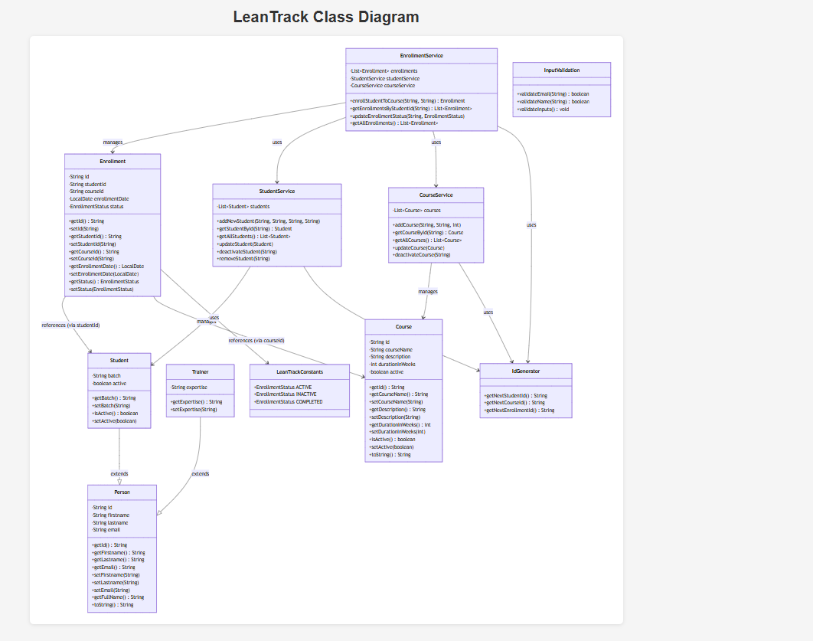

# LearnTrack

## Project Description

LearnTrack is a simple console-based Java application for managing students, courses, and enrollments. It provides a command-line user interface to:

- Add, view, search, and deactivate students
- Add, view, deactivate courses
- Enroll students in courses
- View and update enrollments

The application is implemented with a package structure under `src/com/airtribe/learntrack`, and the main entry point is `com.airtribe.learntrack.ui.Main`.

## Requirements

- Java JDK 8 or newer
- A terminal or IDE with Java support

## Compile and Run

1. Open a terminal in the `LeanTrack` project folder.
2. Create a `bin` output folder (if it does not already exist):

   ```powershell
   mkdir bin
   ```

3. Compile all Java sources from `src` into the `bin` folder.

   - In PowerShell:

     ```powershell
     javac -d bin (Get-ChildItem -Path src -Recurse -Filter *.java | Select-Object -ExpandProperty FullName)
     ```

   - In a Unix-style shell (Git Bash, WSL, etc.):

     ```bash
     javac -d bin $(find src -name "*.java")
     ```

4. Run the application:

   ```powershell
   java -cp bin com.airtribe.learntrack.ui.Main
   ```

## Folder Structure

- `src`: Java source files
- `lib`: external dependencies (if any)
- `bin`: compiled class output files

## Notesss

If you are using Visual Studio Code, the Java extension can also build and run the project directly via the Java Projects view or the Run Code command.


