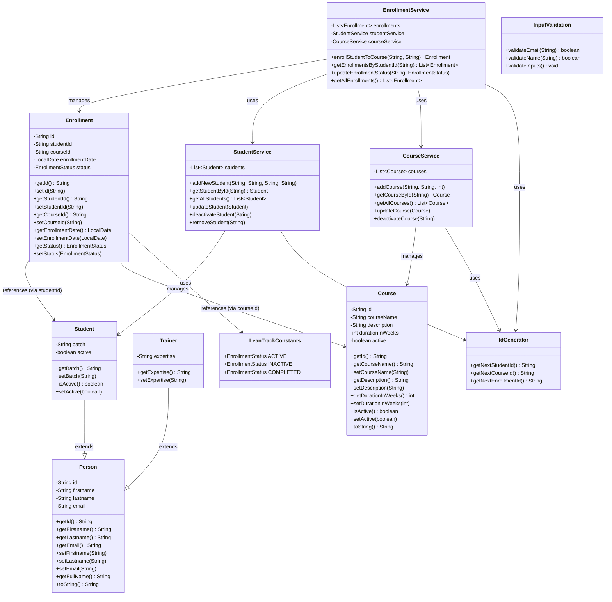

# LeanTrack Class Diagram

This document provides a visual representation of the class structure and relationships in the LeanTrack application.

## Class Hierarchy and Relationships

## Relationship Summary

### Inheritance
- **Student** and **Trainer** both extend **Person**
  - Inherit common properties: id, firstname, lastname, email
  - Student adds: batch, active
  - Trainer adds: expertise

### Aggregation/Composition
- **StudentService** manages a list of **Student** objects
- **CourseService** manages a list of **Course** objects
- **EnrollmentService** manages a list of **Enrollment** objects

### Dependencies
- **EnrollmentService** depends on both **StudentService** and **CourseService**
  - Used to validate student and course existence during enrollment
- **Enrollment** maintains foreign key references to **Student** and **Course**
  - studentId references Student
  - courseId references Course

### Utility Dependencies
- All services use **IdGenerator** to create unique identifiers
- **Enrollment** references **LeanTrackConstants** for EnrollmentStatus enum values
- Input validation utilities are used by services for data validation

## Key Design Patterns

1. **Service Layer Pattern**: Separation of business logic in service classes
2. **Entity-Service Architecture**: Clear separation between data models and business logic
3. **Dependency Injection**: EnrollmentService receives StudentService and CourseService as dependencies
4. **ID Generation**: Centralized ID generation through IdGenerator utility class
